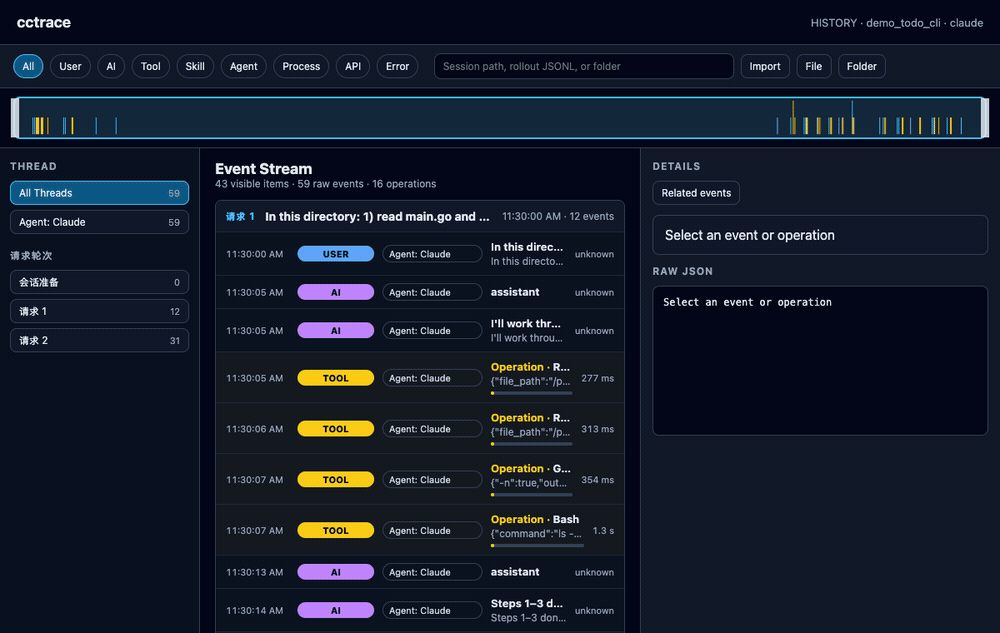
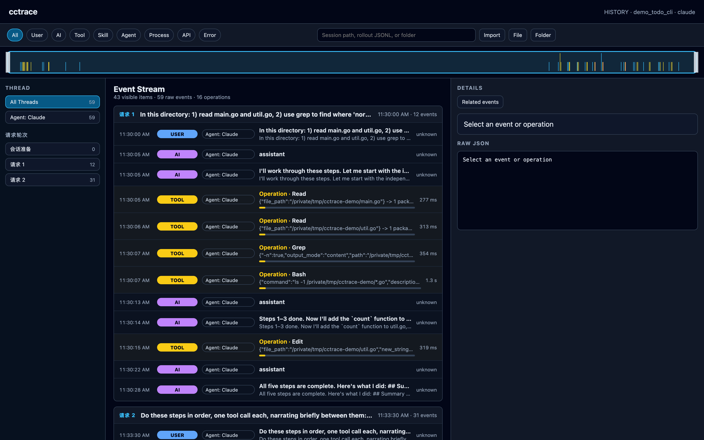
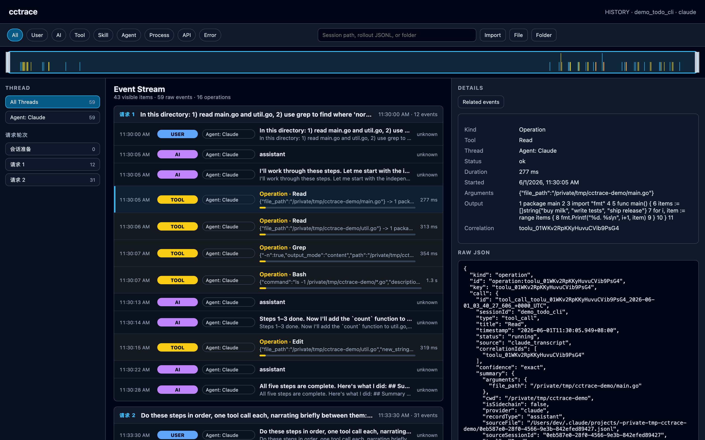
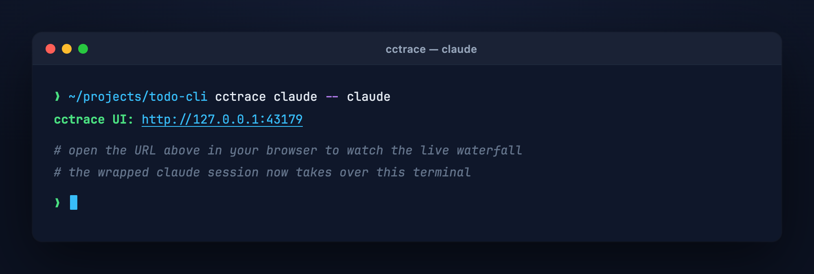
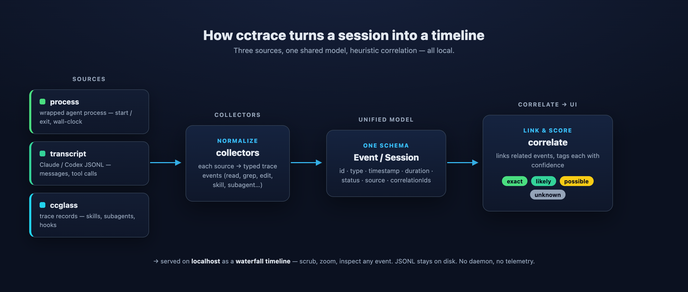

<div align="center">
  <h1>cctrace</h1>
  <p><strong>Real-time profiler for AI coding agents. Wrap Claude Code or Codex, see every event on a local waterfall timeline.</strong></p>
  <p><em>One Go binary. JSONL on disk, web UI on localhost. No daemon, no telemetry, no cloud.</em></p>

  <p>
    <a href="https://github.com/androidZzT/cctrace/stargazers"></a>
    <a href="LICENSE"></a>
    
    
    
  </p>

  <p>
    <a href="#-why-cctrace">Why?</a> &bull;
    <a href="#-features">Features</a> &bull;
    <a href="#%EF%B8%8F-screenshots">Screenshots</a> &bull;
    <a href="#-quick-start">Quick Start</a> &bull;
    <a href="#-cli-reference">CLI</a> &bull;
    <a href="#-data--privacy">Data & Privacy</a> &bull;
    <a href="#%EF%B8%8F-architecture">Architecture</a> &bull;
    <a href="README_CN.md">中文</a>
  </p>
</div>

---

<p align="center">
  
</p>

---

## 🤔 Why cctrace?

When you run Claude Code or Codex on a tricky task, a lot is happening you can't see:

- which tool calls fired and how long each took
- the order of process events vs transcript events vs ccglass records
- when the model thought, paused, retried, or fanned out subagents
- where the wall-clock time actually went

cctrace wraps the agent process, pulls events from process activity, transcript files, and ccglass traces into one shared model, correlates them, and shows the whole session on a local waterfall timeline.

No daemon. No telemetry. JSONL on disk, a small web UI on localhost.

## ✨ Features

- **Wrap any AI coding agent** — `cctrace claude -- <cmd>` or `cctrace codex -- <cmd>` records the run end to end
- **Unified trace model** — process, transcript, and ccglass records become a single Event / Session schema
- **Heuristic correlation** — links related events across sources and tags each link with a confidence score
- **Local waterfall UI** — open the timeline in your browser, scrub, zoom, inspect any event
- **Replayable** — every session is JSONL on disk; replay later with `cctrace view <session-id>`
- **One Go binary** — no Python, no Node, no Docker, no background service

## 🖼️ Screenshots

The waterfall timeline for a recorded session — turn groups on the left, every event (user, AI, tool call, tool result) on a shared time axis, with a density overview up top.



Click any tool operation to inspect its arguments, output, duration, correlation IDs, and the raw event JSON.



## 🚀 Quick Start

```sh
# Install from source
go install github.com/androidZzT/cctrace/cmd/cctrace@latest

# Wrap a Claude Code session
cctrace claude -- claude

# Wrap a Codex session
cctrace codex -- codex

# Replay a recorded session
cctrace view <session-id>
```

Wrapping an agent prints the local UI URL right away — open it to watch the live waterfall:



## 📖 CLI Reference

| Command | What it does |
|---|---|
| `cctrace claude -- <cmd>` | Wrap a Claude Code invocation; record process + transcript + ccglass events |
| `cctrace codex -- <cmd>` | Wrap a Codex invocation; same recording pipeline |
| `cctrace view <session-id>` | Open a saved session in the local web UI |

Run `cctrace --help` for full flags.

## 🔐 Data & Privacy

cctrace is local-first by design:

- The web UI listens on `127.0.0.1:43179` by default.
- Sessions are written under `/tmp/cctrace-sessions` by default.
- Each session contains a `session.json` metadata file and an `events.jsonl` event stream.
- cctrace does not send telemetry and does not upload traces to a hosted service.
- The stored JSONL can include command arguments, tool outputs, transcript snippets, file paths, model metadata, and ccglass request/response timing or usage fields when those sources are available.

Treat trace files like debug logs: they may contain sensitive local paths, prompts, command output, or model/tool payloads. Review or redact them before sharing.

You can replay a saved session without rerunning the agent:

```sh
cctrace view <session-id>
```

The web UI can also import existing trace artifacts from the import bar:

- a cctrace session directory containing `events.jsonl`
- a Codex rollout JSONL file or rollout directory bundle
- a Claude transcript/session folder

This makes cctrace useful both as a live profiler and as a lightweight offline trace viewer.

## 🏗️ Architecture

Three sources flow into one shared model, get correlated with a confidence score, and land on the local timeline:



```
cmd/cctrace                 CLI entry
└── internal/
    ├── app                 wires CLI parsing, collection, persistence, server startup
    ├── trace               shared Event / Session model
    ├── store               JSONL persistence under a session directory
    ├── collectors          process / transcript / ccglass → trace events
    ├── correlate           heuristic event linking with confidence tagging
    └── server              local web UI + event JSON API
```

Sessions are written as JSONL so you can grep, diff, or pipe them into other tools without spinning up cctrace.

## 🛠️ Development

```sh
# Run all tests
go test ./...

# Run the CLI in dev
go run ./cmd/cctrace claude -- claude

# Smoke trace
go run ./cmd/cctrace claude -- sh -c 'printf cctrace-smoke'

# Replay
go run ./cmd/cctrace view <session-id>
```

## 📝 License

[MIT](LICENSE)

## 🙏 Acknowledgements

cctrace reads trace records produced by [ccglass](https://github.com/jianshuo/ccglass) (by [@jianshuo](https://github.com/jianshuo), MIT) as one of its event sources, and the `cctrace <agent> -- <cmd>` ergonomics are inspired by ccglass's wrap-and-inspect approach. If you want to see exactly what your agent sends to the model, go check out ccglass — it pairs well with cctrace.

---

<div align="center">
  <sub>Built with Go. Local-first. No telemetry.</sub>
</div>
